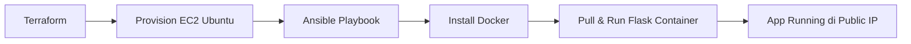

# IaC Terraform + Ansible VM Provisioning

## Overview
Proyek ini mengotomatisasi provisioning VM Ubuntu di AWS menggunakan **Terraform** (Infrastructure as Code) dan konfigurasi Docker + deployment Flask app menggunakan **Ansible**. 
Tujuan: Mensimulasikan pembuatan infrastruktur yang reproducible dan version-controlled hanya dengan kode perintah.

## Tech Stack
- **Terraform** v1.10+ (AWS Provider)
- **Ansible** (playbook Docker + container)
- **AWS** (EC2 t2.micro, Security Group, VPC) – via KodeKloud Playground
- **Docker** + Flask app (reuse image dari [Project 1](https://github.com/seizenz7/devops-flask-ci-cd-kubernetes))
- **KodeKloud AWS Playground** (Business Plan)

## Flowchart Diagram

## Prerequisites
- WSL2 terinstall dan aktif
- Akun KodeKloud Business Plan (untuk AWS)
- Terraform CLI terinstal di WSL2/Windows
- Ansible terinstal di WSL2
- GitHub repo 

---
## Milestone 1: Provision EC2 via Terraform

### Steps 1 - Launch KodeKloud AWS Playground & Ambil Credentials
- Buka browser dan login ke KodeKloud
- Launch AWS Playground
- Ambil kredensial AWS melalui cloudshell aws
  
  Verifikasi siapa yang login `aws sts get-caller-identity`
  
  Ambil temporary credentials`curl -s -H "Authorization: $AWS_CONTAINER_AUTHORIZATION_TOKEN" "$AWS_CONTAINER_CREDENTIALS_FULL_URI" | jq .`
  
- Simpan di notepad

### Steps 2 - Siapkan Terraform & Konfigurasi Provider AWS dengan Temporary Credentials
- Buat repo di github (iac-terraform-ansible-vm) dan clone repo `git clone ....`
- Masuk ke folder repo dan Buat folder terraform `mkdir terraform`
- Masuk ke folder terraform `cd terraform`
- Export kredensial temporary AWS ke env WSL

  `export AWS_ACCESS_KEY_ID=""`

  `export AWS_SECRET_ACCESS_KEY=""`

  `export AWS_SESSION_TOKEN=""`

  `export AWS_REGION=""`

- Buat file [provider.tf](terraform/provider.tf)
- Buat file [variables.tf](terraform/variables.tf)
- Buat file [main.tf](terraform/main.tf)
- Jalankan perintah terraform

  `terraform init`
  
  `terraform validate`
  
  `terraform plan`
  
  `terraform apply -auto-approve`

### Screenshots (Terraform)

- AWS Cloudshell
  
  
  
- Terraform init dan validate
  
  

- Terraform plan

  
  
  
  

- Terraform apply

  
  
  
  

- IP

  

- Hasil instance vm AWS EC2

  

- Koneksi SSH berhasil masuk ke instance vm AWS EC2

  
  
### Challenges & Learnings

- Challenge: Membuat dynamic AMI lookup
- Learning:
    - Mengambil kredensial dengan AWS Cloudshell
    - Membuat kode iac terraform untuk menyiapkan instance vm di AWS EC2 secara otomatis
    - Membuat perintah untuk otomatis generate ssh key dan menyimpan private key di lokal untuk kemudahan akses ssh ke instance EC2
    - Menerapkan minimal security group
    - Menggunakan data source untuk lookup AMI terbaru secara dinamis

---

## Milestone 2: Ansible Configuration & Docker Setup

### Steps

### Screenshots (Ansible)

### Challenges & Learnings

- Challenge: ...
- Learning: ...

---

## Milestone 3: Deploy Flask Application

### Steps

### Screenshots 

### Challenges & Learnings

- Challenge: ...
- Learning: ...

---

## Milestone 4: Documentation & Evidence

### Steps

### Screenshots 

### Challenges & Learnings

- Challenge: ...
- Learning: ...

---
## ***Key Takeaway Keseluruhan Project 2***

