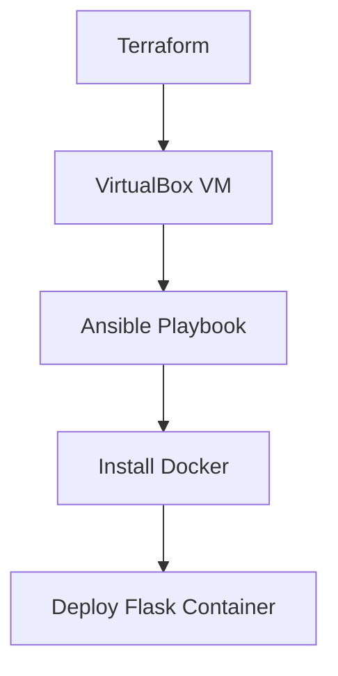

# IaC Terraform + Ansible VM Provisioning

## Overview
Project ini mengotomatisasi provisioning VM Linux menggunakan Terraform sebagai Infrastructure as Code dan Ansible untuk konfigurasi serta deployment Docker. 
Tujuan: mensimulasikan infrastruktur on-prem/hybrid yang reproducible dan version-controlled hanya dengan beberapa perintah.

## Tech Stack
- **Terraform** (IaC provisioning VM di VirtualBox)
- **Ansible** (configuration management + Docker deployment)
- **VirtualBox** (hypervisor lokal gratis)
- **Docker** (container Flask)
- **WSL2 + Windows 11** (environment testing)

## Flowchart Diagram

## Prerequisites
- Windows 11 + WSL2 (Ubuntu 22.04 atau terbaru)
- VirtualBox terinstal di Windows host (bukan di WSL)
- Terraform & Ansible terinstal di WSL2
- Clone GitHub repo 
- Minimal 4 GB RAM & 20 GB disk kosong

---
## Milestone 1 

### Screenshots (Terraform)

### Challenges & Learnings

- Challenge: ...
- Learning: ...

---

## Milestone 2 

### Screenshots (Ansible)

### Challenges & Learnings

- Challenge: ...
- Learning: ...

---

## Milestone 3 

### Screenshots 

### Challenges & Learnings

- Challenge: ...
- Learning: ...

---
## ***Key Takeaway Keseluruhan Project 2***
Project ini mengubah proses provisioning manual menjadi infrastruktur yang sepenuhnya deklaratif dan otomatis.
