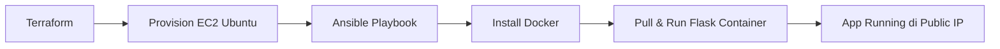

# IaC Terraform + Ansible VM Provisioning

## Overview
Proyek ini mengotomatisasi provisioning VM Ubuntu di AWS menggunakan **Terraform** (Infrastructure as Code) dan konfigurasi Docker + deployment Flask app menggunakan **Ansible**. 
Tujuan: Mensimulasikan pembuatan infrastruktur yang reproducible dan version-controlled hanya dengan beberapa perintah.

## Tech Stack
- **Terraform** v1.10+ (AWS Provider)
- **Ansible** (playbook Docker + container)
- **AWS** (EC2 t2.micro, Security Group, VPC) – via KodeKloud Playground
- **Docker** + Flask app (reuse image dari [Project 1](https://github.com/seizenz7/devops-flask-ci-cd-kubernetes))
- **KodeKloud AWS Playground** (Business Plan)

## Flowchart Diagram

## Prerequisites
Akun KodeKloud Business Plan (untuk AWS)
Terraform CLI terinstal di WSL2/Windows
Ansible terinstal di WSL2
GitHub repo ini sudah di-clone

---
## Milestone 1: Provision EC2 via Terraform

### Steps

### Screenshots (Terraform)

### Challenges & Learnings

- Challenge: ...
- Learning: ...

---

## Milestone 2: Ansible Configuration & Docker Setup

### Steps

### Screenshots (Ansible)

### Challenges & Learnings

- Challenge: ...
- Learning: ...

---

## Milestone 3: Deploy Flask Application

### Steps

### Screenshots 

### Challenges & Learnings

- Challenge: ...
- Learning: ...

---

Milestone 4: Documentation & Evidence

### Steps

### Screenshots 

### Challenges & Learnings

- Challenge: ...
- Learning: ...

---
## ***Key Takeaway Keseluruhan Project 2***
Project ini mengubah proses provisioning manual menjadi infrastruktur yang sepenuhnya deklaratif dan otomatis.
