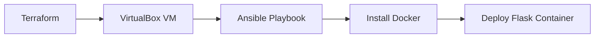

# IaC Terraform + Ansible VM Provisioning

## Overview
Project ini mengotomatisasi provisioning VM Linux menggunakan Terraform sebagai Infrastructure as Code dan Ansible untuk konfigurasi serta deployment Docker. 
Tujuan: mensimulasikan infrastruktur on-prem/hybrid yang reproducible dan version-controlled hanya dengan beberapa perintah.

## Tech Stack
- IaC: Terraform
- Provisioning: VirtualBox
- Configuration Management: Ansible
- Container: Docker
- OS: Ubuntu 20.04 LTS
- Documentation: Markdown + Mermaid

## Flowchart Diagram


## Prerequisites
Sebelum memulai, pastikan alat berikut sudah terinstal di komputer Anda:

- Terraform versi 1.5 atau lebih baru
- VirtualBox versi 7.x atau lebih baru (with ubuntu server 20.04 LTS)
- Git
- Ansible (akan digunakan di Milestone 2)

## Installation & Setup
```bash
1. Instalasi VirtualBox
# Windows: Unduh dari https://www.virtualbox.org/wiki/Downloads
# Linux (Ubuntu/Debian):
sudo apt update && sudo apt install virtualbox -y
2. Instalasi Terraform
Windows: Unduh dari https://developer.hashicorp.com/terraform/downloads
# Linux (Ubuntu/Debian):
sudo apt update && sudo apt install terraform -y
3. Setup Repositori
git clone https://github.com/seizenz7/iac-terraform-ansible-vm.git
cd iac-terraform-ansible-vm
mkdir -p terraform ansible
4. Verifikasi Instalasi
terraform version
VBoxManage --version
ansible --version
```

---

## Milestone 1 - Terraform VM Provisioning

- Definisi resource VM dengan provider VirtualBox
- Konfigurasi jaringan bridged untuk akses SSH/Ansible

### How to Run
```bash
Bashterraform init
terraform validate
terraform apply
```
### Screenshots (Terraform)

Output terraform plan
VM muncul di VirtualBox Manager

### Challenges & Learnings

- Challenge: ...
- Learning: ...

---

## Milestone 2 - Ansible Playbook & Docker Deployment

- Inventory dan playbook untuk instalasi Docker
- Task deployment container Flask

### How to Run
```bash
Bashansible-playbook -i inventory.ini playbook.yml
```

### Screenshots (Ansible)

Output playbook execution
Container berjalan di VM

### Challenges & Learnings

- Challenge: ...
- Learning: ...

---

## Milestone 3 - Full Automation & Best Practices

- Variabel Terraform + Ansible roles
- Idempotency dan security hardening

### How to Run
```bash
Bashterraform apply
ansible-playbook playbook.yml
```

### Screenshots (Full Flow)

Terraform + Ansible berhasil
Aplikasi Flask dapat diakses

### Challenges & Learnings

- Challenge: ...
- Learning: ...

---
## ***Key Takeaway Keseluruhan Project 2***
Project ini mengubah proses provisioning manual menjadi infrastruktur yang sepenuhnya deklaratif dan otomatis.
