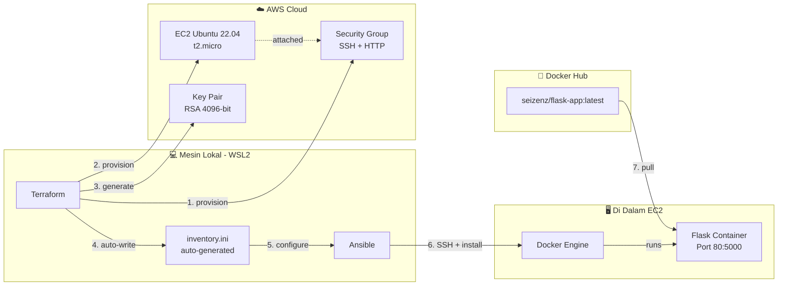

<div align="center">

# IaC Terraform + Ansible VM Provisioning

[](https://www.terraform.io/)
[](https://www.ansible.com/)
[](https://aws.amazon.com/)
[](https://www.docker.com/)
[](https://flask.palletsprojects.com/)

🌎 **Language:** [Bahasa Indonesia](#bahasa-indonesia) | [English](#english)

</div>

---

<a id="bahasa-indonesia"></a>
## Tentang Proyek

Proyek ini mengotomatisasi siklus penuh sebuah server cloud — dari nol hingga aplikasi web berjalan — menggunakan pendekatan **Infrastructure as Code (IaC)** yang sepenuhnya deklaratif dan *version-controlled*. Dengan menggabungkan **Terraform** untuk provisioning infrastruktur dan **Ansible** untuk manajemen konfigurasi dan deployment, seluruh environment dapat direproduksi secara konsisten hanya dengan beberapa perintah.

> **Bagian dari DevOps Learning Series** — Proyek ini menggunakan Docker image yang dibangun dan dipublikasikan di [Project 1: Flask CI/CD Kubernetes](https://github.com/seizenz7/devops-flask-ci-cd-kubernetes).

### 📋 Daftar Isi
- [Tujuan Proyek](#-tujuan-proyek)
- [Tech Stack](#-tech-stack)
- [Arsitektur](#-arsitektur)
- [Keputusan Arsitektur](#-keputusan-arsitektur)
- [Konfigurasi](#-konfigurasi)
- [Cara Menjalankan](#-cara-menjalankan)
- [Dokumentasi Screenshot](#-dokumentasi-screenshot)
- [Catatan Keamanan](#-catatan-keamanan)
- [Tantangan & Pembelajaran](#-tantangan--pembelajaran)

### 🎯 Tujuan Proyek

| Tujuan | Status |
|--------|--------|
| Provision VM cloud secara otomatis via kode | ✅ Selesai |
| Konfigurasi server & instalasi Docker via Ansible | ✅ Selesai |
| Deploy aplikasi Flask dalam container ke cloud | ✅ Selesai |
| Struktur file terorganisir & dapat dikonfigurasi | ✅ Selesai |
| Generate inventory Ansible otomatis dari output Terraform | ✅ Selesai |

### 🛠 Tech Stack

| Tool | Versi | Fungsi |
|------|-------|--------|
| **Terraform** | ≥ 1.5 | Provisioning infrastruktur (EC2, Security Group, SSH Key) |
| **Ansible** | ≥ 2.15 | Konfigurasi server & deployment Docker |
| **AWS EC2** | t2.micro | Virtual machine cloud (Ubuntu 22.04 LTS) |
| **AWS Security Group** | — | Aturan firewall (SSH + HTTP) |
| **Docker CE** | latest | Container runtime di dalam VM |
| **Flask App** | — | Aplikasi web contoh (dari Project 1) |
| **WSL2** | — | Lingkungan pengembangan lokal (Windows) |

### 🏛 Arsitektur

#### Alur Sistem


```mermaid
flowchart LR
    subgraph Local["💻 Mesin Lokal - WSL2"]
        TF[Terraform]
        ANS[Ansible]
        INV[inventory.ini\nauto-generated]
    end

    subgraph AWS["☁️ AWS Cloud"]
        SG[Security Group\nSSH + HTTP]
        EC2[EC2 Ubuntu 22.04\nt2.micro]
        KEY[Key Pair\nRSA 4096-bit]
    end

    subgraph VM["🖥️ Di Dalam EC2"]
        DOCKER[Docker Engine]
        FLASK[Flask Container\nPort 80:5000]
    end

    subgraph Hub["🐳 Docker Hub"]
        IMAGE[seizenz/flask-app:latest]
    end

    TF -->|"1. provision"| SG
    TF -->|"2. provision"| EC2
    TF -->|"3. generate"| KEY
    TF -->|"4. auto-write"| INV
    EC2 -.->|"attached"| SG
    INV -->|"5. configure"| ANS
    ANS -->|"6. SSH + install"| DOCKER
    IMAGE -->|"7. pull"| FLASK
    DOCKER -->|"runs"| FLASK
```

#### Struktur Folder

```
iac-terraform-ansible-vm/
├── 📁 terraform/                    # Infrastruktur (Terraform)
│   ├── provider.tf                  # Konfigurasi AWS provider & lock versi Terraform
│   ├── variables.tf                 # Semua variabel yang dapat dikonfigurasi
│   ├── compute.tf                   # Resource EC2 instance & SSH Key
│   ├── security.tf                  # Security Group (aturan firewall)
│   ├── outputs.tf                   # Output Public IP & perintah SSH
│   ├── inventory.tf                 # Auto-generate inventory.ini untuk Ansible
│   ├── inventory.ini.tpl            # Template inventory Ansible
│   └── terraform.tfvars.example     # 📋 Copy ke terraform.tfvars untuk konfigurasi
│
├── 📁 ansible/                      # Konfigurasi Server (Ansible)
│   ├── playbook.yml                 # Playbook utama (configurable via vars)
│   └── inventory.ini                # ⚙️ Di-generate otomatis oleh Terraform
│
├── 📁 screenshots/                  # Dokumentasi visual
├── .gitignore                       # Exclude .pem, .tfstate, .tfvars
└── README.md
```

### 💡 Keputusan Arsitektur

#### Mengapa Terraform?

Terraform dipilih dibanding provisioning manual di AWS Console atau AWS CloudFormation karena:
- **Syntax deklaratif** — deskripsikan *apa* yang diinginkan, bukan *bagaimana* membuatnya
- **State management** — melacak infrastruktur nyata dan mendeteksi perubahan tidak terduga (*drift*)
- **Agnostik Cloud** — Terraform mendukung berbagai provider (meskipun proyek ini berfokus pada AWS)
- **Version-controlled** — perubahan infrastruktur dapat di-review via Git seperti kode biasa

#### Mengapa Ansible?

Ansible dipilih dibanding Chef atau Puppet karena:
- **Agentless** — tidak perlu install daemon di server target, cukup gunakan SSH
- **YAML-based** — playbook yang mudah dibaca manusia, kurva belajar rendah
- **Idempotent** — aman dijalankan berkali-kali, tidak akan menduplikasi perubahan
- **Library modul besar** — dukungan native untuk Docker via `community.docker`

#### Mengapa Organisasi File Terpisah?

Kode Terraform dipecah menjadi file-file terpisah berdasarkan tanggung jawab (`compute.tf`, `security.tf`, `outputs.tf`) agar:
- Lebih mudah dibaca dan di-maintain oleh tim
- Setiap file memiliki konteks yang jelas dan spesifik
- Terraform secara otomatis menggabungkan semua file `.tf` dalam satu direktori — pemisahan murni untuk organisasi kode

#### Mengapa Auto-Generate Inventory?

Daripada hardcode IP server di `inventory.ini`, Terraform secara otomatis men-*generate* file inventory setiap kali EC2 dibuat menggunakan resource `local_file` + `templatefile()`. Ini menghilangkan langkah manual dan membuat pipeline benar-benar otomatis — cukup jalankan `terraform apply` dan inventory sudah siap untuk Ansible.

### ⚙ Konfigurasi

Semua nilai yang dapat dikustomisasi dikontrol via **variabel** — tidak ada nilai *hardcoded* di dalam kode Terraform maupun Ansible.

#### Variabel Terraform (`terraform.tfvars`)

Copy file contoh dan sesuaikan:
```bash
cp terraform/terraform.tfvars.example terraform/terraform.tfvars
# Edit terraform.tfvars sesuai kebutuhan
```

| Variabel | Default | Keterangan |
|----------|---------|------------|
| `aws_region` | `us-east-1` | Region AWS target |
| `instance_type` | `t2.micro` | Tipe EC2 (eligible free tier) |
| `instance_name` | `devops-flask-vm` | Nama tag EC2 di AWS Console |
| `ssh_key_name` | `devops-flask-key` | Nama SSH Key Pair |
| `security_group_name` | `devops-flask-sg` | Nama Security Group |
| `app_port` | `80` | Port HTTP yang dibuka |
| `allowed_ssh_cidr` | `["0.0.0.0/0"]` | CIDR yang boleh SSH (batasi untuk production!) |

#### Variabel Ansible (`playbook.yml` → blok `vars:`)

```yaml
vars:
  docker_user: ubuntu                    # User yang ditambahkan ke docker group
  flask_image: seizenz/flask-app:latest  # Docker image yang akan di-deploy
  container_name: flask-app              # Nama container yang dijalankan
  host_port: 80                          # Port yang diekspos di VM
  container_port: 5000                   # Port internal Flask di container
  health_endpoint: /health               # Endpoint untuk health check
```

### 🚀 Cara Menjalankan

#### Prasyarat
- WSL2 aktif (untuk pengguna Windows)
- [Terraform CLI](https://developer.hashicorp.com/terraform/install) terinstal
- [Ansible](https://docs.ansible.com/ansible/latest/installation_guide/index.html) terinstal di WSL2
- Akun AWS aktif dengan kredensial yang valid
- Jalankan `ansible-galaxy collection install community.docker`

#### Langkah 1 — Set Kredensial AWS

```bash
export AWS_ACCESS_KEY_ID="YOUR_KEY_ID"
export AWS_SECRET_ACCESS_KEY="YOUR_SECRET_KEY"
export AWS_SESSION_TOKEN="YOUR_SESSION_TOKEN"   # Jika menggunakan temporary credentials
export AWS_REGION="us-east-1"
```

#### Langkah 2 — Konfigurasi Terraform

```bash
cd terraform/
cp terraform.tfvars.example terraform.tfvars
# Edit terraform.tfvars jika perlu mengubah konfigurasi
```

#### Langkah 3 — Provision Infrastruktur

```bash
terraform init        # Download providers
terraform validate    # Validasi syntax
terraform plan        # Preview perubahan yang akan dibuat
terraform apply -auto-approve   # Buat infrastruktur di AWS
```

> Setelah `apply` selesai, Terraform **otomatis membuat** file `../ansible/inventory.ini` berisi IP publik EC2 yang baru dibuat.

#### Langkah 4 — Konfigurasi Server & Deploy Aplikasi

```bash
cd ../ansible/

# Test koneksi SSH ke EC2
ansible all -i inventory.ini -m ping

# Cek syntax playbook
ansible-playbook -i inventory.ini playbook.yml --syntax-check

# Jalankan playbook: install Docker + deploy Flask container
ansible-playbook -i inventory.ini playbook.yml
```

#### Langkah 5 — Verifikasi

```bash
# Buka di browser (ganti dengan IP dari terraform output)
# http://<PUBLIC_IP>

# Atau cek dari terminal
curl http://<PUBLIC_IP>/health
```

#### Langkah 6 — Teardown (Bersihkan Infrastruktur)

```bash
cd ../terraform/
terraform destroy -auto-approve   # Hapus SEMUA resource dari AWS
```

### 📸 Dokumentasi Screenshot

#### Milestone 1 — Provisioning Infrastruktur (Terraform)

**AWS Credentials**


**Terraform Init & Validate**


**Terraform Plan**


**Terraform Apply — Infrastruktur Berhasil Dibuat**


**Instance EC2 Aktif di AWS Console**


**Output Public IP & Koneksi SSH Berhasil**


---

#### Milestone 2 — Konfigurasi Server (Ansible + Docker)

**Test Koneksi Ansible & Syntax Check**


**Ansible Playbook Berjalan — Docker Terinstal**


**Verifikasi Docker di EC2**


---

#### Milestone 3 — Deployment Aplikasi Flask

**Ansible Deploy — Flask Container Berjalan**


**Flask App Dapat Diakses via Public IP**


**Status Container Docker**


### ⚠ Catatan Keamanan

- File `*.pem` (private key SSH) dan `*.tfstate` (berisi data sensitif) sudah dikecualikan dari Git via `.gitignore`
- File `terraform.tfvars` juga dikecualikan; gunakan `terraform.tfvars.example` sebagai template
- Untuk **production**: ganti `allowed_ssh_cidr` dari `0.0.0.0/0` ke IP spesifik Anda
- Untuk **kolaborasi tim**: gunakan *remote backend* (AWS S3 + DynamoDB) untuk menyimpan `terraform.tfstate` secara aman

### 🎓 Tantangan & Pembelajaran

#### Milestone 1 — Terraform

| Tantangan | Pembelajaran |
|-----------|-------------|
| Membuat dynamic AMI lookup agar bekerja di region manapun | Menggunakan `data "aws_ami"` dengan filter nama dan owner ID Canonical |
| Auto-generate SSH key tanpa `ssh-keygen` manual | Provider `tls_private_key` + `aws_key_pair` + `local_file` dengan `file_permission = "0400"` |
| Mengelola kredensial AWS temporary (KodeKloud) | Export ke environment variables — tidak perlu file `~/.aws/credentials` |
| Menghindari hardcode IP di inventory Ansible | Resource `local_file` + `templatefile()` untuk auto-generate `inventory.ini` setelah EC2 dibuat |
| Organisasi kode Terraform agar mudah di-maintain | Memecah kode berdasarkan tanggung jawab — file `.tf` dalam satu direktori otomatis digabung Terraform |

#### Milestone 2 — Ansible

| Tantangan | Pembelajaran |
|-----------|-------------|
| Ansible-lint violation (FQCN, truthy value, trailing space) | Selalu gunakan `ansible.builtin.*` dan `true`/`false`, bukan `yes`/`no` |
| Setup Docker repo dengan metode modern | Menggunakan `/etc/apt/keyrings/` + `signed-by` adalah cara terbaru dan aman |

#### Milestone 3 — Deployment

| Tantangan | Pembelajaran |
|-----------|-------------|
| Reuse Docker image dari proyek sebelumnya | `community.docker.docker_container` bisa langsung pull & run dari Docker Hub |
| Port mapping `80:5000` | Expose port VM (80) ke port internal container (5000) cukup untuk demo tanpa Nginx |

### 🔗 Proyek Terkait

- 🔗 **Project 1 — CI/CD Pipeline**: [devops-flask-ci-cd-kubernetes](https://github.com/seizenz7/devops-flask-ci-cd-kubernetes) — Source code Flask app, Docker image, CI/CD pipeline, dan Kubernetes deployment

### 📄 Lisensi

Proyek ini dilisensikan di bawah MIT License — lihat [LICENSE](LICENSE) untuk detail.

---
## ***Key Takeaway***
Dalam proyek ini saya berhasil membangun **Otomatisasi Infrastructure as Code** yang lengkap. Dengan menggabungkan **Terraform** untuk provisioning infrastruktur (EC2 Ubuntu) dan **Ansible** untuk konfigurasi serta deployment aplikasi (Docker + Flask container), seluruh proses menjadi 100% deklaratif, idempotent, dan reproducible. Kode Terraform diorganisasi dengan rapi (`compute.tf`, `security.tf`, `outputs.tf`) dan inventory Ansible di-generate secara otomatis — menghasilkan infrastruktur dasar yang siap pakai dan mudah direproduksi.

---

<a id="english"></a>
## About This Project

This project automates the full lifecycle of a cloud server — from zero to a running web application — using a fully declarative, version-controlled Infrastructure as Code (IaC) approach. By combining **Terraform** for infrastructure provisioning and **Ansible** for configuration management and deployment, the entire environment can be reproduced reliably with a single set of commands.

> **Part of a DevOps Learning Series** — This project uses the Docker image built and published in [Project 1: Flask CI/CD Kubernetes](https://github.com/seizenz7/devops-flask-ci-cd-kubernetes).

### 📋 Table of Contents
- [Project Goals](#-project-goals)
- [Tech Stack](#-tech-stack-1)
- [Architecture](#-architecture)
- [Architecture Decisions](#-architecture-decisions)
- [Configuration](#-configuration)
- [Quick Start](#-quick-start)
- [Screenshots](#-screenshots)
- [Security Notes](#-security-notes)
- [Challenges & Learnings](#-challenges--learnings-1)

### 🎯 Project Goals

| Goal | Status |
|------|--------|
| Provision cloud VM automatically via code | ✅ Done |
| Configure server & install Docker via Ansible | ✅ Done |
| Deploy containerized Flask app to cloud | ✅ Done |
| Organized & configurable file structure | ✅ Done |
| Auto-generate Ansible inventory from Terraform output | ✅ Done |

### 🛠 Tech Stack

| Tool | Version | Purpose |
|------|---------|---------|
| **Terraform** | ≥ 1.5 | Infrastructure provisioning (EC2, SG, SSH Key) |
| **Ansible** | ≥ 2.15 | Server configuration & Docker deployment |
| **AWS EC2** | t2.micro | Cloud virtual machine (Ubuntu 22.04 LTS) |
| **AWS Security Group** | — | Firewall rules (SSH + HTTP) |
| **Docker** | latest | Container runtime on the VM |
| **Flask App** | — | Sample web application (from Project 1) |
| **WSL2** | — | Local development environment (Windows) |

### 🏛 Architecture

#### System Flow


```mermaid
flowchart LR
    subgraph Local["💻 Local Machine - WSL2"]
        TF[Terraform]
        ANS[Ansible]
        INV[inventory.ini\nauto-generated]
    end

    subgraph AWS["☁️ AWS Cloud"]
        SG[Security Group\nSSH + HTTP]
        EC2[EC2 Ubuntu 22.04\nt2.micro]
        KEY[Key Pair\nRSA 4096-bit]
    end

    subgraph VM["🖥️ Inside EC2"]
        DOCKER[Docker Engine]
        FLASK[Flask Container\nPort 80:5000]
    end

    subgraph Hub["🐳 Docker Hub"]
        IMAGE[seizenz/flask-app:latest]
    end

    TF -->|"1. provision"| SG
    TF -->|"2. provision"| EC2
    TF -->|"3. generate"| KEY
    TF -->|"4. auto-write"| INV
    EC2 -.->|"attached"| SG
    INV -->|"5. configure"| ANS
    ANS -->|"6. SSH + install"| DOCKER
    IMAGE -->|"7. pull"| FLASK
    DOCKER -->|"runs"| FLASK
```

#### Folder Structure

```
iac-terraform-ansible-vm/
├── 📁 terraform/                    # Infrastructure (Terraform)
│   ├── provider.tf                  # AWS provider config & Terraform version lock
│   ├── variables.tf                 # All configurable variables
│   ├── compute.tf                   # EC2 instance & SSH Key resources
│   ├── security.tf                  # Security Group (firewall rules)
│   ├── outputs.tf                   # Public IP & SSH command output
│   ├── inventory.tf                 # Auto-generate Ansible inventory.ini
│   ├── inventory.ini.tpl            # Ansible inventory template
│   └── terraform.tfvars.example     # 📋 Copy to terraform.tfvars for config
│
├── 📁 ansible/                      # Server Configuration (Ansible)
│   ├── playbook.yml                 # Main playbook (configurable via vars)
│   └── inventory.ini                # ⚙️ Auto-generated by Terraform
│
├── 📁 screenshots/                  # Visual documentation
├── .gitignore                       # Exclude .pem, .tfstate, .tfvars
└── README.md
```

### 💡 Architecture Decisions

#### Why Terraform?

Terraform was chosen over manual AWS Console provisioning or CloudFormation because:
- **Declarative syntax** — describe what you want, not how to build it
- **State management** — tracks real infrastructure and detects drift
- **Provider Agnostic** — Terraform supports multiple clouds (though this project targets AWS)
- **Version-controlled** — infrastructure changes are reviewable via Git

#### Why Ansible?

Ansible was chosen over Chef or Puppet because:
- **Agentless** — no daemon to install on target servers, uses SSH
- **YAML-based** — human-readable playbooks, low learning curve
- **Idempotent** — safe to run multiple times, will not duplicate changes
- **Huge module library** — native Docker support via `community.docker`

#### Why Separate File Organization?

Terraform code is split into separate files by responsibility (`compute.tf`, `security.tf`, `outputs.tf`) so that:
- Code is easier to read and maintain across teams
- Each file has clear, specific context
- Terraform automatically merges all `.tf` files in the same directory — splitting is purely for code organization

#### Why Auto-Generate Inventory?

Instead of hardcoding the server IP in `inventory.ini`, Terraform automatically generates the inventory file every time an EC2 instance is created using `local_file` + `templatefile()`. This eliminates manual steps and makes the pipeline fully automated — just run `terraform apply` and the inventory is ready for Ansible.

### ⚙ Configuration

All customizable values are controlled via **variables** — no hardcoded values in Terraform or Ansible code.

#### Terraform Variables (`terraform.tfvars`)

Copy the example file and customize:
```bash
cp terraform/terraform.tfvars.example terraform/terraform.tfvars
# Edit terraform.tfvars as needed
```

| Variable | Default | Description |
|----------|---------|-------------|
| `aws_region` | `us-east-1` | Target AWS region |
| `instance_type` | `t2.micro` | EC2 type (free tier eligible) |
| `instance_name` | `devops-flask-vm` | EC2 name tag in AWS Console |
| `ssh_key_name` | `devops-flask-key` | SSH Key Pair name |
| `security_group_name` | `devops-flask-sg` | Security Group name |
| `app_port` | `80` | HTTP port to open |
| `allowed_ssh_cidr` | `["0.0.0.0/0"]` | CIDR allowed for SSH (restrict for production!) |

#### Ansible Variables (`playbook.yml` → `vars:` block)

```yaml
vars:
  docker_user: ubuntu                    # User added to docker group
  flask_image: seizenz/flask-app:latest  # Docker image to deploy
  container_name: flask-app              # Container name
  host_port: 80                          # Port exposed on VM
  container_port: 5000                   # Internal Flask port in container
  health_endpoint: /health               # Health check endpoint
```

### 🚀 Quick Start

#### Prerequisites
- WSL2 active (for Windows users)
- [Terraform CLI](https://developer.hashicorp.com/terraform/install) installed
- [Ansible](https://docs.ansible.com/ansible/latest/installation_guide/index.html) installed in WSL2
- Active AWS account with valid credentials
- Run `ansible-galaxy collection install community.docker`

#### Step 1 — Set AWS Credentials

```bash
export AWS_ACCESS_KEY_ID="YOUR_KEY_ID"
export AWS_SECRET_ACCESS_KEY="YOUR_SECRET_KEY"
export AWS_SESSION_TOKEN="YOUR_SESSION_TOKEN"   # If using temporary credentials
export AWS_REGION="us-east-1"
```

#### Step 2 — Configure Terraform

```bash
cd terraform/
cp terraform.tfvars.example terraform.tfvars
# Edit terraform.tfvars if needed
```

#### Step 3 — Provision Infrastructure

```bash
terraform init        # Download providers
terraform validate    # Validate syntax
terraform plan        # Preview changes
terraform apply -auto-approve   # Create infrastructure on AWS
```

> After `apply` completes, Terraform **automatically creates** `../ansible/inventory.ini` with the new EC2 public IP.

#### Step 4 — Configure Server & Deploy App

```bash
cd ../ansible/

# Test SSH connection to EC2
ansible all -i inventory.ini -m ping

# Check playbook syntax
ansible-playbook -i inventory.ini playbook.yml --syntax-check

# Run playbook: install Docker + deploy Flask container
ansible-playbook -i inventory.ini playbook.yml
```

#### Step 5 — Verify

```bash
# Open in browser (replace with IP from terraform output)
# http://<PUBLIC_IP>

# Or check from terminal
curl http://<PUBLIC_IP>/health
```

#### Step 6 — Teardown

```bash
cd ../terraform/
terraform destroy -auto-approve   # Remove ALL resources from AWS
```

### 📸 Screenshots

> Screenshots are identical to the [Bahasa Indonesia](#-dokumentasi-screenshot) section above. Please scroll up to view all milestone screenshots.

### ⚠ Security Notes

- `*.pem` (SSH private key) and `*.tfstate` (contains sensitive data) are excluded from Git via `.gitignore`
- `terraform.tfvars` is also excluded; use `terraform.tfvars.example` as a template
- For **production**: restrict `allowed_ssh_cidr` from `0.0.0.0/0` to your specific IP
- For **team collaboration**: use a remote backend (AWS S3 + DynamoDB) to securely store `terraform.tfstate`

### 🎓 Challenges & Learnings

#### Milestone 1 — Terraform

| Challenge | Learning |
|-----------|----------|
| Dynamic AMI lookup across any region | Used `data "aws_ami"` with name filter and Canonical owner ID |
| Auto-generate SSH key without manual `ssh-keygen` | `tls_private_key` + `aws_key_pair` + `local_file` with `file_permission = "0400"` |
| Managing temporary AWS credentials (KodeKloud) | Export to environment variables — no `~/.aws/credentials` file needed |
| Avoiding hardcoded IP in Ansible inventory | `local_file` + `templatefile()` to auto-generate `inventory.ini` after EC2 creation |
| Organizing Terraform code for maintainability | Split code by responsibility — `.tf` files in the same directory are merged automatically by Terraform |

#### Milestone 2 — Ansible

| Challenge | Learning |
|-----------|----------|
| Ansible-lint violations (FQCN, truthy, trailing space) | Always use `ansible.builtin.*` and `true`/`false`, not `yes`/`no` |
| Modern Docker repo setup | `/etc/apt/keyrings/` + `signed-by` method is the modern, secure way |

#### Milestone 3 — Deployment

| Challenge | Learning |
|-----------|----------|
| Reusing Docker image from previous project | `community.docker.docker_container` pulls and runs directly from Docker Hub |
| Port mapping `80:5000` | Exposing VM port 80 to container port 5000 is sufficient for demo without Nginx |

### 🔗 Related Projects

- 🔗 **Project 1 — CI/CD Pipeline**: [devops-flask-ci-cd-kubernetes](https://github.com/seizenz7/devops-flask-ci-cd-kubernetes) — Flask app source code, Docker image, CI/CD pipeline, and Kubernetes deployment

### 📄 License

This project is licensed under the MIT License — see [LICENSE](LICENSE) for details.

---
## ***Key Takeaway***
In this project I successfully built a complete **end-to-end Infrastructure as Code automation**. By combining **Terraform** for infrastructure provisioning (EC2 Ubuntu) and **Ansible** for configuration and application deployment (Docker + Flask container), the entire process is 100% declarative, idempotent, and reproducible. Terraform code is neatly organized (`compute.tf`, `security.tf`, `outputs.tf`) and Ansible inventory is auto-generated — resulting in a baseline infrastructure that is ready to use and easy to reproduce.

---

<div align="center">

**Built with ❤️ as part of a DevOps Engineering learning journey**

*Terraform · Ansible · AWS · Docker*

</div>
